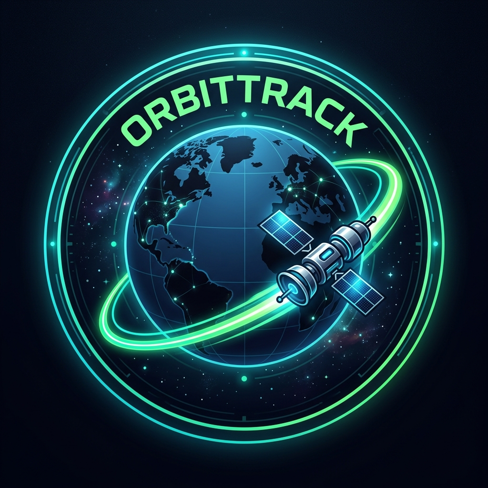

# 🛰️ OrbitTrack: Multi-Agent Satellite Tracker

<p align="center">
  
</p>

OrbitTrack is a multi-agent orbital tracking pipeline built using **LangGraph**, powered by a custom **Model Context Protocol (MCP)** server, and integrated with **Discord** (via Webhooks and an interactive Bot interface).

---

## 🚀 Key Features

* **Multi-Agent Orchestration**: Powered by LangGraph, coordinating three distinct specialized agents:
  1. **Tracker Agent**: Retrieves and normalizes satellite TLE (Two-Line Element) orbital data.
  2. **Astronomer Agent**: Geocodes ZIP codes to coordinates and computes orbital pass metrics.
  3. **Broadcaster Agent**: Dispatches rich, structured flyover alerts directly to Discord.
* **Custom MCP Server**: Exposes CelesTrak querying, OpenStreetMap Nominatim geocoding, and `skyfield` orbital calculation engines.
* **Dual Discord Interfaces**:
  - **Broadcast Mode**: Automatic outbound pushes via Discord Webhooks.
  - **Interactive Bot Mode**: Command-driven tracking using Slash Commands (`/track`).
* **Environment Variable Isolation**: Zero-leak security design separating Discord Webhooks, Bot Tokens, and Gemini API keys.
* **Offline Fallback**: Runs in deterministic mode using rule-based calculations if AI keys are omitted.

---

## 🎨 System Graphics

### 📡 Tracker Node
Responsible for capturing telemetry, normalizing satellite nomenclature, and retrieving active Two-Line Elements (TLEs):
<p align="center">
  
</p>

### 📢 Broadcaster Avatar
Represents the notification bot dispatching alerts and rich embeds to channels:
<p align="center">
  
</p>

---

## 🛠️ Installation

Ensure you have Python 3.9+ installed, then install OrbitTrack in editable mode:

```bash
pip install -e .
```

This registers the global CLI tool `orbit-track` on your environment's PATH.

---

## ⚙️ Configuration

Create a `.env` file in the root directory:

```env
# Discord Webhook URL for automated alerts
DISCORD_WEBHOOK_URL=https://discord.com/api/webhooks/your_id/your_token

# Interactive Bot Token (optional)
DISCORD_BOT_TOKEN=your_discord_bot_token_here

# Google Gemini API Key (optional - enables AI-assisted formatting)
GEMINI_API_KEY=your_gemini_api_key_here
```

---

## 💻 CLI Usage

The developer command-line interface supports predicting, spawning standalone servers, or booting the Discord bot.

### Run Predictions
Predict the next upcoming flyover for a satellite (e.g., the ISS) over a global location (e.g., "Paris, France" or a ZIP code):
```bash
orbit-track --predict "ISS" --location "Paris, France"
```

### Start the Standalone MCP Server
Expose the tools via stdio to third-party clients (like Cursor or Claude Desktop):
```bash
orbit-track --run-server
```

### Start the Interactive Bot
Run the background bot listening for Discord Slash Commands:
```bash
orbit-track --run-bot
```

---

## 🤖 Discord Slash Commands

Once the bot is invited and running, users can trigger calculations dynamically from Discord:

```text
/track satellite: ISS zip_code: 94103
```

The bot will run the LangGraph pipeline and respond with a detailed, timezone-adjusted embed showing pass duration, culmination times, and max elevation.
